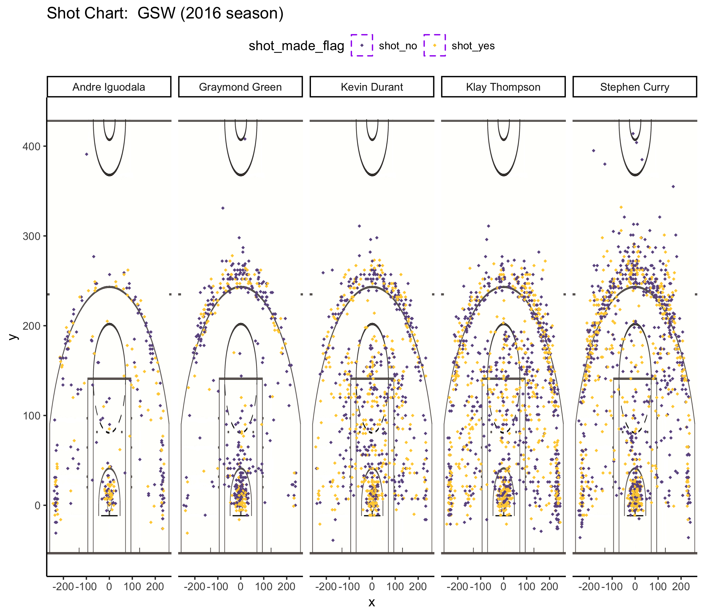

workout01-Sze Ka-Yip.Rmd
================
Sze Ka Yip
3/9/2019



``` r
library(dplyr)
```

    ## 
    ## Attaching package: 'dplyr'

    ## The following objects are masked from 'package:stats':
    ## 
    ##     filter, lag

    ## The following objects are masked from 'package:base':
    ## 
    ##     intersect, setdiff, setequal, union

``` r
dat <- read.csv(file='../data/shots-data.csv')
pt2t <- as.data.frame(table(dat$name, dat$shot_type=="2PT Field Goal"))
names(pt2t)[1] <-"name"
names(pt2t)[3] <-"total"
pt2t <- pt2t[pt2t[2] == TRUE, c(1,3)]
a<- ((dat$shot_made_flag=="shot_yes")&(dat$shot_type=="2PT Field Goal") )
pt2m <- as.data.frame(table(dat$name, a))
pt2m <- pt2m[pt2m[2] == TRUE, 3]
table_pt2 <- data.frame( pt2t,made=pt2m)
table_pt2$perc_made <- table_pt2$made/table_pt2$total
table_pt2 <- arrange(table_pt2, desc(perc_made))
table_pt2_effective_shooting_by_player <- table_pt2
table_pt2_effective_shooting_by_player 
```

    ##             name total made perc_made
    ## 1 Andre Iguodala   210  134 0.6380952
    ## 2   Kevin Durant   643  390 0.6065319
    ## 3  Stephen Curry   563  304 0.5399645
    ## 4  Klay Thompson   640  329 0.5140625
    ## 5 Graymond Green   346  171 0.4942197

``` r
pt3t <- as.data.frame(table(dat$name, dat$shot_type=="3PT Field Goal"))
names(pt3t)[1] <-"name"
names(pt3t)[3] <-"total"
pt3t <- pt3t[pt3t[2] == TRUE, c(1,3)]
a <- ((dat$shot_made_flag=="shot_yes")&(dat$shot_type=="3PT Field Goal") )
pt3m <- as.data.frame(table(dat$name, a))
pt3m <- pt3m[pt3m[2] == TRUE, 3]
table_pt3 <- data.frame(pt3t,made=pt3m)
table_pt3$perc_made <- table_pt3$made/table_pt3$total
table_pt3 <- arrange(table_pt3, desc(perc_made))
table_pt3_effective_shooting_by_player <- table_pt3
table_pt3_effective_shooting_by_player
```

    ##             name total made perc_made
    ## 1  Klay Thompson   580  246 0.4241379
    ## 2  Stephen Curry   687  280 0.4075691
    ## 3   Kevin Durant   272  105 0.3860294
    ## 4 Andre Iguodala   161   58 0.3602484
    ## 5 Graymond Green   232   74 0.3189655

``` r
tab<- (dat$shot_type=="3PT Field Goal") |  (dat$shot_type=="2PT Field Goal")
tab <-as.data.frame(table(dat$name, tab))
names(tab)[1] <-"name"
names(tab)[3] <-"total"
tab <-tab[ , c(1,3)]
made <- (dat$shot_made_flag=="shot_yes") & ((dat$shot_type=="3PT Field Goal") |  (dat$shot_type=="2PT Field Goal"))
made <-data.frame(table(dat$name, made))
made<-made[made[2]==TRUE, 3]
table23<-data.frame(tab,made)
table23$perc_made <- table23$made/ table23$total
table23 <- arrange(table23, desc(perc_made))
table23
```

    ##             name total made perc_made
    ## 1   Kevin Durant   915  495 0.5409836
    ## 2 Andre Iguodala   371  192 0.5175202
    ## 3  Klay Thompson  1220  575 0.4713115
    ## 4  Stephen Curry  1250  584 0.4672000
    ## 5 Graymond Green   578  245 0.4238754

5.2) Narrartive:
----------------

### **Introduction:**

WHO IS YOUR FAVARITE PLAYER?
============================

FOR ME?
-------

**Stephen Curry!**
==================


[Brady Klopfer, a Golden State Warriors Community](https://www.goldenstateofmind.com/2018/2/21/17010344/2018-nba-golden-state-warriors-steph-curry-efficiency-deep-threes-layups)

> Steph Curry is as efficient from 30 feet as he is from 3 feet *The greatest shooter of all time is as unstoppable near the logo as he is in the pain.*

[John Schuhmanna, NBA.com](https://www.nba.com/article/2017/12/14/one-team-one-stat-warriors-shooting-better-ever)

> One Team, One Stat -- Golden State Warriors' shooting the best in NBA history again

Are you a fan of the American Golden Sate Warrior basketball team? Who is your favorate player? Do you want to anything about how Golden Sate Warrior teams play in the session? Check this out!

**Purpose**

The purpose of this report this to give you the 2016 season NBA data of 5 Warriors' players: Andre Iguodala, Draymond Green, Kevin Durant, Klay Thompson, Stephen Curry, use the data to anaylize, compare and comtrast the data in terms of the effective shooting percentage statistics tables and through the image of the Golden Sate Warrior shot charts of the hottest five Golden Gate Warrior players in the team, therefore, based on the data we have, we are able to get a conclusion or make prediction of the shooting performance of the players.


**Organize the content**

**motivation**

From our everyday life, think about how we predict and choose events that we think is the most likely event? Anaylizing the data and table will give us a more accuratue anwer to this question. Therefore, our motivation is by gather and collect the data, anaylize the data, we are able to get a report or conclusion from data anaylzing, which means, by looking at the effective shooting percentage statistics tables and through the image of the Golden Sate Warrior shot charts, we are able to give more persion conclusion about who is the most better of player in Golden Gate Warrior team.

**background**

Golden Sate Warrior team has many great players, they are Stephen Curry, Kevin Durant, Klay Thompson, DeMarcus Cousion, Andrew Bogut, Draymond Green, Damion Lee, Andre Iguodala, Jonas Jerebko, Alfonzo Mckinnie, Jordan Bell, Shuan Livingston, Kevon Looney, Damian Jones, Quinn Cook, Jacob Evans, and Marcus Drrickson. The most popular Golden Sate Warrior team players and this report which analysis these most famous player, they are Stephen Curry, Kevin Durant, Klay Thompson, Andre Iguodala, Draymond Green! In this article, it includes three tables about the effectiveshooting percentage, for example: 2 points effective shooting % by player, 3 points effective shooting % by player, the last but not lease, the effective shooting % by player.

###### **Andre Iguodalag**


###### **Kevin Durant**


###### **Graymond Green**


###### **Klay Thompson**


###### **Stephen Curry**


**Data**

the data that we used here are from [shots-data.csv](https://github.com/SzeKaYip/workout01/blob/master/data/shots-data.csv)

-   team\_name: Golden State Warriors. Golden State Warriors, a American professional basketball team from Oakland, California.
-   game\_date: the date when Golden State Warriors team play againsted other teams.
-   season: In NBA, the regular season began in early October and end in June. Around 82 number of games and 30 number of teams. The 82 games schedule for 6 months and approximate 3 games per week.
-   period: an NBA game is divided in 4 periods of 12 mins each. For example, a value for period = 1 refers to the first period (the first 12 mins of the game).
-   minutes\_remaining and seconds\_remaining have to do with the amount of time in minutes and seconds, respectively, that remained to be played in a given period.
-   shot\_made\_flag indicates whether a shot was made (y) or missed (n).
-   action\_type has to do with the basketball moves used by players, either to pass by defenders to gain access to the basket, or to get a clean pass to a teammate to score a two pointer or three pointer.
-   shot\_type indicates whether a shot is a 2-point field goal, or a 3-point field goal.
-   shot\_distance: distance to the basket (measured in feet). +opponent: the team play against with GSW.
-   x and y refer to the court coordinates (measured in inches) where a shot occurred . +Court Size: The Professional NBA and (WNBA) Court is 94 feet long and 50 feet wide.
-   The Foul Line: For all courts including the NBA, the “foul line” distance is 15 feet from the foul line to the front of the backboard. The “foul line” is 18 feet 10 inches from the baseline.

more information: (<https://www.sportsknowhow.com/basketball/dimensions/nba-basketball-court-dimensions.html>)


**Analysis & discussion**

we wll use these three tables for the effectiveshooting percentage:

1.table: 2 points effective shooting % by player

2.table: 3 points effective shooting % by player

3.table: the effective shooting % by player

-   table1: 2 points effective shooting % by player

    2 points effective shooting % by player table, the data which gives the name of the player, the amount of the shots they made individually, and how many shots they made within the total shots, the last column which indicate the percentage of the point, made/total and the percentage gives in descending order.

| name           |  total|  made|  perc\_made|
|:---------------|------:|-----:|-----------:|
| Andre Iguodala |    210|   134|   0.6380952|
| Kevin Durant   |    643|   390|   0.6065319|
| Stephen Curry  |    563|   304|   0.5399645|
| Klay Thompson  |    640|   329|   0.5140625|
| Graymond Green |    346|   171|   0.4942197|

From table of the 2 points effective shooting bt player, we can see that Andre Iguodala has the lowerest total points, 210 compaire to other 4 players. Kevin Durant has the highest total points, 643. However, by looking at the percentage of made/total, andre Iguodal has the highest percentage, which is 0.6380952, compare to Kevin Durant, which has 0.6065319 pecentage of effective shooting.

**conclusion**
Since Kevin Durant made the most shooting 390, We can conclude that Kevin Durant is the most likely better player for the 2 points shooting.

-   table2: 3 points effective shooting % by player

For 3 points effective shooting % by player table, it includes: players' name, and the total points of the 3 points, and made shots they made within the total 3 point shots, the last column which indicate the percentage of the point, made/total in 3 point shooting, and percentage is giving in descending order.

| name           |  total|  made|  perc\_made|
|:---------------|------:|-----:|-----------:|
| Klay Thompson  |    580|   246|   0.4241379|
| Stephen Curry  |    687|   280|   0.4075691|
| Kevin Durant   |    272|   105|   0.3860294|
| Andre Iguodala |    161|    58|   0.3602484|
| Graymond Green |    232|    74|   0.3189655|

From table of the 3 points effective shooting by players, it is obvious that we see Andre Iguodala total points, 210 compaire to others. Stephen Curry has the highest total points, 687, and by looking at the percentage of made/total, Klay Thompson has the highest percentage, which is 0.4241379, and Stephen Curry is the second highest in percentage which is 0.4075691, compare to Graymond Green, which has the lowest 0.3189655 pecentage of effective shooting. From this, we can conclusion that klay Thompson and Stephen Curry is good at 3 points shooting.

**conclusion**
By comparing the two tables, 2 points effective shooting percentage by player and 3 point effective shooting percentage by player, we may conclude that Stephen Curry is better at 3 points, which percentage is 0.4075691 compare to other players and Kevin Durant is better at 2 points shooting compare to other four players.

-   table3: the effective shooting % by player

    The last table which indicates the overall points, that is, 2 points shooting and 3 points shooting effective percentage by player, also the percentage is in descending order.

| name           |  total|  made|  perc\_made|
|:---------------|------:|-----:|-----------:|
| Kevin Durant   |    915|   495|   0.5409836|
| Andre Iguodala |    371|   192|   0.5175202|
| Klay Thompson  |   1220|   575|   0.4713115|
| Stephen Curry  |   1250|   584|   0.4672000|
| Graymond Green |    578|   245|   0.4238754|

From the last table, effective shooting percentage by player, which combine the 2 points and 3 points together and anaylize the table we can see that Andre Iguodala has the lowest 371 total points and he has 192 made shot, and the second highest percentage wihtin the five players, which is 0.5175202. Stephen Curry has the most shooting total in 2 points and 3 points, 1250, and he had made 584 within 1250 shots. Stephen Curry has 0.4672000 percentage effevtive shooting, and he made the most shooting points 584. Graymond Green made 578 total shots and he made 245 of the 578 shots, Graymond Green has the lowest percentage compare to other five players, which is 0.4238754.

**conclusion**
Andre Iguodala has the lowest total points and Stephen Curry made the most shooting points, Kevin Durant has the highest effective shooting percentage wihtin the five players.

**Shot chart**


From the faceting shot chart, we can see that the player from the Golden State Warriors shooting from the half court by their position, made shot, and miss shot.
**conclusion**
Stephen Curry has the most total shots compare to other four players, and Andre Iguodala has the minimun total points compare to others.

[Stephen Shea ARE THE WARRIORS MAKING THE MID-RANGE RELEVANT AGAIN?](https://shottracker.com/articles/are-the-warriors-making-the-mid-range-relevant-again)

> On the season, Curry took 130 mid-range jumpers and shot 60% on them. That’s good for 1.2 PPS. A Curry mid-range attempt is an elite NBA shot in terms of efficiency.

###### Stephen Curry


[5 WILD STATS DEFINING GOLDEN STATE WARRIOURS' SEASON --ZACH BUCKLEY](https://bleacherreport.com/articles/2749739-5-wild-stats-defining-golden-state-warriors-season#slide0)

> In other words, the Warriors are—statistically speaking—again one of the greatest teams of all time, even as many don't yet paint them as the greatest club of this campaign.

**Take-home message**

From this article, and by anaylizing the faceting shot chart and the three tables of effective shooting percentage, we may conclude that for 2 points efftective shooting: Kevin Durant made the most shooting, which gives a hint that Kevin Durant is the most likely better player for the 2 points shooting and Andre Iguodal has the highest percentage. 3 points effective shooting: Klay Thompson has the highest percentage, and Stephen Curry has the highest total points. From the 3rd table, effective shooting percentage by player, Stephen Curry has the most shooting total in 2 points and 3 points.Overall, I would say that Stephen Curry is the best player since he made the most shot among the 5 players, and his 3 points is the second highest in percentage and his 2 points percentage is 3rd higest. : ) .

**Reference**

[shots-data.csv](https://github.com/SzeKaYip/workout01/blob/master/data/shots-data.csv)

[basketball-court](https://www.sportsknowhow.com/basketball/dimensions/nba-basketball-court-dimensions.html)

[a picture of the basketball court](http://www.sportscourtdimensions.com/wp-content/uploads/2015/02/nba_court_dimensions_h.png)

[Stephen Curry](https://media.gettyimages.com/photos/guard-stephen-curry-of-the-golden-state-warriors-brings-the-ball-down-picture-id499786990)

[Brady Klopfer, a Golden State Warriors Community](https://www.goldenstateofmind.com/2018/2/21/17010344/2018-nba-golden-state-warriors-steph-curry-efficiency-deep-threes-layups)

[John Schuhmanna, NBA.com](https://www.nba.com/article/2017/12/14/one-team-one-stat-warriors-shooting-better-ever)

[GSW team picture](https://media.gettyimages.com/photos/the-20162017-golden-state-warriors-team-poses-for-a-team-photo-on-17-picture-id691230836)

[Andre Iguodalag](https://www.gannett-cdn.com/-mm-/7349fb2ec8fa6eae87731d37a08df41a4a952655/c=320-223-4187-2408/local/-/media/2018/05/31/USATODAY/USATODAY/636633217332508663-2018-05-30-Andre-Iguodala.jpg?width=3200&height=1680&fit=crop)

[Kevin Durant](https://media.gettyimages.com/photos/kevin-durant-of-the-golden-state-warriors-smiles-against-the-denver-picture-id1129298072)

[Graymond Green](https://cdn.images.express.co.uk/img/dynamic/4/590x/Draymond-Green-was-heavily-involved-in-Nick-Young-s-trade-to-Golden-State-828767.jpg)

[Klay Thompson](https://media.gettyimages.com/photos/klay-thompson-of-the-golden-state-warriors-dribbles-the-ball-during-picture-id1128167742)

[Stephen Shea ARE THE WARRIORS MAKING THE MID-RANGE RELEVANT AGAIN?](https://shottracker.com/articles/are-the-warriors-making-the-mid-range-relevant-again)

[Stephen Curry](https://a2.espncdn.com/combiner/i?img=%2Fphoto%2F2016%2F0131%2Fr49664_1296x729_16%2D9.jpg)

[5 WILD STATS DEFINING GOLDEN STATE WARRIOURS' SEASON --ZACH BUCKLEY](https://bleacherreport.com/articles/2749739-5-wild-stats-defining-golden-state-warriors-season#slide0)
