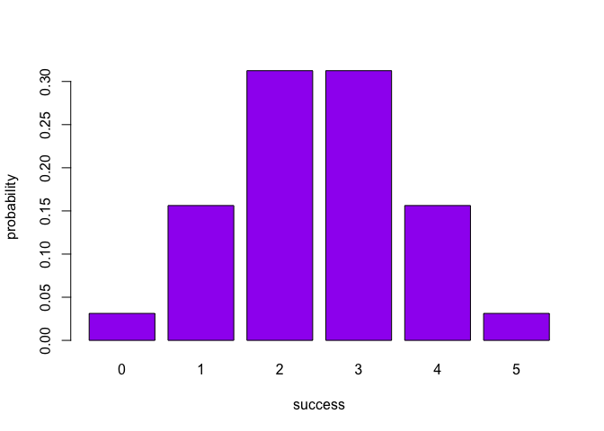
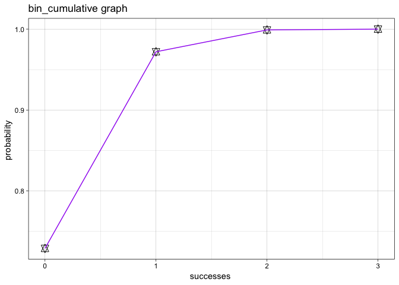

Overview
--------

"binomial" is a package that provides functions to calculate the binomial probability distribution functions

### `bin_choose` is a function that computes the number of success in given trials

### `bin_probability` is a function that computes the probability of getting successes in given trials.

### `bin_distribution` is a function that computes the probability distribution.

### `bin_cumulative` is a function that computes the cumulative distribution.

### `bin_variable` is a function that computes the measurement of the variables.

### Functions `bin_mean()`, `bin_variance()`, `bin_mode()`, `bin_skewness()`, `bin_kurtosis()` calculate the measurments of the binomial functions.

### `plot.bincum()` method for a "bincum" object to graph the cumulative distribution

### `plot.bindis()` method for a "bindis" object to graphs a barplot to display the probability histogram

### `print.binvar()` method for a "binvar" object to nicely print the content

### `summary.binvar()` method for a "binvar" object to get a full summary description

### `print.summary.binvar()` method for a "summary.binvar" object to nicely print the contents

Motivation
----------

This package is to provide binomial probability distribution functions that illustrates binomial concepts.

Installation
------------

Install the development version from GitHub via the package `"devtools"`:

``` r


# development version from GitHub:
#install.packages("devtools") 
# install "binomial" (without vignettes)
devtools::install_github("stat133-sp19/hw-stat133-yipszeka/workout03/binomial")
# install "binomial" (with vignettes)
devtools::install_github("stat133-sp19/hw-stat133-yipszeka/workout03/binomial", build_vignettes = TRUE)
```

Usage
-----

``` r

library(binomial)

library(ggplot2)

# binomial choose 
bin_choose()
#> [1] 1

#binomial probability 
bin_probability(1,2,0.6)
#> [1] 0.48
#bin_cumulative
w<- bin_cumulative(3,0.1)
w
#>   success probability cumulative
#> 1       0       0.729      0.729
#> 2       1       0.243      0.972
#> 3       2       0.027      0.999
#> 4       3       0.001      1.000

#binomial distribution
q <- bin_distribution()
q
#>   success probability
#> 1       0     0.03125
#> 2       1     0.15625
#> 3       2     0.31250
#> 4       3     0.31250
#> 5       4     0.15625
#> 6       5     0.03125

#plot probability density graph
plot(q)
```



    #>      [,1]
    #> [1,]  0.7
    #> [2,]  1.9
    #> [3,]  3.1
    #> [4,]  4.3
    #> [5,]  5.5
    #> [6,]  6.7

    #plot cumulative graph
    plot(w)



``` r

#bin_variable
bin_variable(10,0.3)
#> "Binomial variable"
#> 
#> Paramaters
#> -number of trials:10 
#> -prob of success:0.3
a <-summary(bin_variable(trials = 10, p = 0.3))
a
#> 
#> 
#> "Summary Binomial"
#> 
#> Paramaters
#> -number of trials: 10 
#> -prob of success: 0.3 
#> 
#> Measures
#> -mean: 3 
#> -variance: 2.1 
#> -mode: 3 
#> -skewness: 0.2760262 
#> -kurtosis -0.1238095
```

### Functions of meansures functions

``` r

library(binomial)

bin_mean(10, 0.3)
#> [1] 3
bin_variance(10, 0.3)
#> [1] 2.1
bin_mode(10, 0.3)
#> [1] 3

bin_skewness(10, 0.3)
#> [1] 0.2760262

bin_kurtosis(10, 0.3)
#> [1] -0.1238095
```
